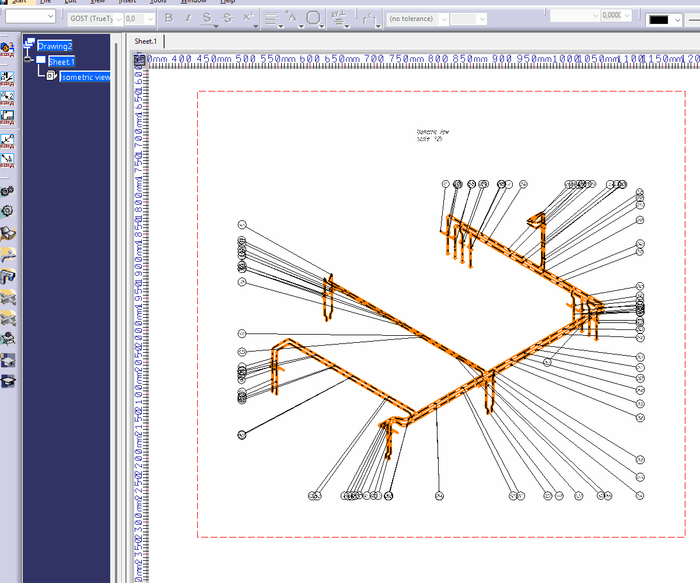
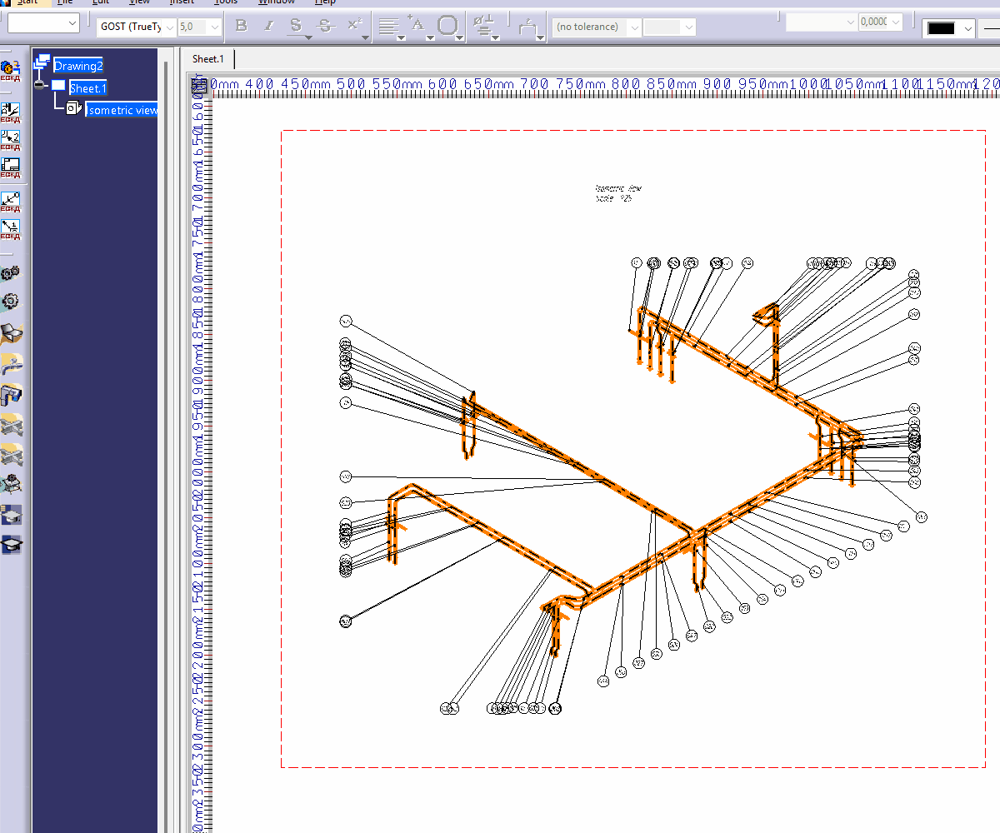

# 📐 CATIA V5 — SmartAlign Balloons

Smart alignment and perimeter distribution of CATIA V5 Drafting Balloons with geometry-aware Leader ordering.

🇷🇺 [Русская версия](#-русская-версия)  
🇬🇧 [English version](#-english-version)

---

## 🎞 Demo

### SmartAlignBalloons — выравнивание вдоль линии

[](images/CATIA_V5_SmartAlignBalloons.gif)

### SmartAlignBalloons Perimeter — распределение по периметру

[](images/CATIA_V5_SmartAlignBalloons_Perimeter.gif)

🎬 YouTube — обе CATScript-команды + добавление на Toolbar:

https://youtu.be/9SV4Cotpmvs

---

## 📦 Files

- `CATIA_V5_SmartAlignBalloons_v09_step_by_step.CATScript` — интерактивное выравнивание Balloons вдоль одной линии.
- `CATIA_V5_SmartAlignBalloons_Perimeter_v01.CATScript` — автоматическое распределение Balloons по четырём сторонам параллелограмма.
- `VBAProjectAlignBalloons.catvba` — исходная VBA-версия проекта с UserForm.
- `src/` — исходный код VBA-проекта.

---

# 🇷🇺 Русская версия

## 🧩 О проекте

Проект начался с VBA-макроса для CATIA V5 Drafting, который автоматически выравнивал Balloons вдоль выбранной `Line2D` и подбирал их порядок с учётом геометрии Leaders.

Позже идея была развита в две отдельные CATScript-команды:

1. `SmartAlignBalloons` — интерактивное выравнивание вдоль линии.
2. `SmartAlignBalloons Perimeter` — распределение большого количества Balloons сразу по четырём сторонам вокруг вида.

Основная задача алгоритма — не просто поставить Balloons на одинаковом расстоянии, а согласовать:

```text
порядок Balloons ↔ положение Anchor Points их Leaders
```

Это помогает уменьшить количество пересекающихся Leader Lines и сократить ручную корректировку чертежа.

> Алгоритм не выполняет прямую проверку пересечения каждой пары Leader-сегментов. Пересечения уменьшаются за счёт геометрически более подходящего порядка Balloons.

---

## 🆚 Почему не стандартный Element Positioning?

CATIA V5 содержит штатную команду:

```text
Tools → Positioning → Element Positioning
```

Она позволяет выравнивать, распределять и задавать расстояние между выбранными аннотациями.

CATIA Help:

https://catiahelp.azurewebsites.net/English/Lo1UserMap/id13dmaster-t-Annotations-PositionModify.htm

Для обычного позиционирования этого достаточно, но при большом количестве Balloons возникает другая задача: выбрать такой порядок аннотаций, чтобы геометрия Leaders была более читаемой.

SmartAlign добавляет именно этот геометрический анализ.

---

# 1️⃣ SmartAlignBalloons v0.9

Файл:

```text
CATIA_V5_SmartAlignBalloons_v09_step_by_step.CATScript
```

Этот вариант заменяет старую схему с UserForm на прямое интерактивное управление в Drafting.

## ⚙️ Workflow

1. Выберите `DrawingText` / Balloons с Leaders.
2. При необходимости удалите `Positional Link`.
3. При необходимости установите:

```text
Anchor Point = Middle Center
```

4. Укажите первую точку линии.
5. Двигайте мышь — появляется чёрная пунктирная направляющая.
6. Вторым кликом зафиксируйте направление и длину.
7. Balloons начинают занимать рассчитанные позиции по одному.

---

## 👀 Step-by-step placement

После второго клика Balloons перемещаются не одним кадром.

Алгоритм последовательно показывает:

```text
Target 1 → выбрать Balloon → переместить
Target 2 → пересчитать оставшиеся → переместить следующий
Target 3 → пересчитать снова
...
```

Это позволяет визуально видеть работу алгоритма.

---

## 🧠 Алгоритм

Если выбрано `N` Balloons, линия делится на:

```text
N + 1
```

равных интервалов.

Balloons занимают внутренние точки между началом и концом линии.

Для каждой очередной Target Point анализируются все оставшиеся Balloons.

Используется геометрия:

```text
Current Target → Leader Anchor Point
```

и направление линии выравнивания.

После выбора одного Balloon он исключается из списка, а для следующей позиции расчёт выполняется заново:

```text
N
↓
N - 1
↓
N - 2
↓
...
↓
1
```

Порядок поэтому не является заранее фиксированной сортировкой.

---

## 🔗 Positional Link

Некоторые DrawingText могут быть связаны с геометрией через `AssociativeElement`.

Если такая связь мешает свободному перемещению Balloon, SmartAlign может удалить Positional Link перед размещением.

---

## ⭕ Middle Center

Для круглых Balloons визуальный центр особенно важен.

Опция:

```text
Anchor Point = Middle Center
```

позволяет размещать Balloon относительно его центра, а не другого Anchor Point.

---

# 2️⃣ SmartAlignBalloons Perimeter v0.1

Файл:

```text
CATIA_V5_SmartAlignBalloons_Perimeter_v01.CATScript
```

Этот режим предназначен для плотных сборочных и изометрических видов, где Balloons удобно распределять сразу вокруг всего изображения.

---

## 🎞 Perimeter demo

[](images/CATIA_V5_SmartAlignBalloons_Perimeter.gif)

---

## 📐 Построение области

Нужно указать только три точки:

```text
P1 → P2 → P3
```

Первая сторона создаётся:

```text
P1 → P2
```

После фиксации `P2` из этой же точки сразу начинается построение:

```text
P2 → P3
```

Четвёртая вершина рассчитывается автоматически:

```text
P4 = P1 + (P3 - P2)
```

Получается параллелограмм:

```text
P1 ───────────── P2
│ \             / │
│   \     C   /   │
│     \     /     │
│     /     \     │
│   /         \   │
│ /             \ │
P4 ───────────── P3
```

Все вспомогательные линии — чёрные и пунктирные.

---

## △ Четыре области

Две диагонали делят параллелограмм на четыре треугольника.

Каждый Balloon классифицируется по точке привязки первого Leader.

```text
P1-P2-C → сторона P1-P2
P2-P3-C → сторона P2-P3
P3-P4-C → сторона P3-P4
P4-P1-C → сторона P4-P1
```

Если Anchor Point находится на границе или за пределами параллелограмма, Balloon назначается ближайшей стороне.

---

## 🔄 Распределение по сторонам

После формирования четырёх групп каждая сторона обрабатывается независимо тем же SmartAlign-алгоритмом:

```text
N → выбрать → переместить
N - 1 → пересчитать → выбрать следующий
N - 2 → пересчитать снова
...
1
```

Обход выполняется по периметру:

```text
P1 → P2 → P3 → P4 → P1
```

После завершения все временные стороны и диагонали удаляются.

---

## 🛠 Добавление CATScript на Toolbar

В видео также показано, как добавить CATScript-макросы на Toolbar CATIA V5 и запускать их без постоянного открытия Macro dialog.

🎬 Видео:

https://youtu.be/9SV4Cotpmvs

После этого SmartAlign можно использовать почти как отдельную пользовательскую Drafting-команду.

---

# 🧬 Original VBA version

Исходная версия проекта:

```text
VBAProjectAlignBalloons.catvba
```

Она использует немодальный `UserForm` и выбранный объект `Line2D`.

[](images/example.gif)

[](images/userform.png)

### Workflow VBA

1. Выбрать `Line2D`.
2. Нажать «Извлечь координаты линии».
3. Получить `X1, Y1, X2, Y2`.
4. Запустить «Выровнить позиции вдоль линии».
5. Выбрать DrawingText с Leaders.
6. Выполнить SmartAlign.

🎬 Предыдущее видео:

📐 CATIA V5 VBA макрос — выравнивание выносок (Balloons) в чертежах Drafting

https://youtu.be/UVtbpVKDkvY

---

## 🧱 Структура репозитория

```text
CATIA-V5-VBA-Align-Balloons/
│
├── CATIA_V5_SmartAlignBalloons_v09_step_by_step.CATScript
├── CATIA_V5_SmartAlignBalloons_Perimeter_v01.CATScript
├── VBAProjectAlignBalloons.catvba
├── README.md
├── LICENSE
│
├── src/
│   ├── ModuleAlignBalloons.bas
│   ├── UserFormAlignBalloons.frm
│   └── UserFormAlignBalloons.frx
│
└── images/
    ├── example.gif
    ├── userform.png
    ├── CATIA_V5_SmartAlignBalloons.gif
    └── CATIA_V5_SmartAlignBalloons_Perimeter.gif
```

---

## ⚠️ Ограничения

- анализируется первый Leader каждого `DrawingText`;
- прямой pairwise-анализ пересечений Leader Lines не выполняется;
- результат основан на геометрии Anchor Points;
- сложные чертежи всё ещё могут потребовать небольшой ручной корректировки;
- удаление Positional Link изменяет ассоциативность выбранной аннотации;
- CATScript-версии ориентированы на CATIA V5 Drafting.

---

## 📄 Лицензия

MIT License.

---

# 🇬🇧 English version

## 🧩 About

The project started as a VBA macro for CATIA V5 Drafting that automatically aligned Balloons along a selected `Line2D` while choosing their order according to Leader geometry.

The idea was later developed into two standalone CATScript tools:

1. `SmartAlignBalloons` — interactive alignment along one line.
2. `SmartAlignBalloons Perimeter` — automatic distribution of many Balloons around four sides of a drawing view.

The main goal is not only equal spacing. The algorithm tries to coordinate:

```text
Balloon order ↔ Leader Anchor Point geometry
```

This can reduce crossing Leader Lines and the amount of manual drawing cleanup.

> The algorithm does not explicitly test every pair of Leader segments for intersection. Crossings are reduced through geometry-aware Balloon ordering.

---

## 🆚 Why not the standard Element Positioning command?

CATIA V5 provides:

```text
Tools → Positioning → Element Positioning
```

for aligning, spacing and distributing annotations.

CATIA Help:

https://catiahelp.azurewebsites.net/English/Lo1UserMap/id13dmaster-t-Annotations-PositionModify.htm

That is useful for standard annotation positioning, but a dense Balloon layout introduces another problem: choosing an order that produces cleaner Leader geometry.

SmartAlign adds this geometry-aware ordering.

---

# 1️⃣ SmartAlignBalloons v0.9

File:

```text
CATIA_V5_SmartAlignBalloons_v09_step_by_step.CATScript
```

This version replaces the old UserForm workflow with direct interactive control in Drafting.

## ⚙️ Workflow

1. Select `DrawingText` / Balloons with Leaders.
2. Optionally remove `Positional Link`.
3. Optionally set:

```text
Anchor Point = Middle Center
```

4. Pick the first alignment point.
5. Move the mouse to preview a black dashed guide line.
6. Click the second point to fix its direction and length.
7. Balloons are placed one by one.

---

## 👀 Step-by-step placement

After the second click, the Balloons do not jump into position in one frame.

The command visibly performs:

```text
Target 1 → select Balloon → move
Target 2 → recalculate remaining Balloons → move next
Target 3 → recalculate again
...
```

---

## 🧠 Algorithm

For `N` selected Balloons, the alignment line is divided into:

```text
N + 1
```

equal intervals.

The Balloons occupy the internal target points.

For every target, all remaining Balloons are evaluated again using:

```text
Current Target → Leader Anchor Point
```

relative to the alignment direction.

Once one Balloon is selected and moved, it is removed from the candidate set and all remaining candidates are recalculated for the next target:

```text
N
↓
N - 1
↓
N - 2
↓
...
↓
1
```

The ordering is therefore not a one-time predefined sort.

---

## 🔗 Positional Link

A DrawingText may be associated with drawing geometry through `AssociativeElement`.

If that positional association prevents the Balloon from moving to its calculated target, SmartAlign can remove the Positional Link before alignment.

---

## ⭕ Middle Center

For circular Balloons, the visual center is especially important.

The optional:

```text
Anchor Point = Middle Center
```

setting lets the algorithm place the Balloon using its center rather than another text anchor.

---

# 2️⃣ SmartAlignBalloons Perimeter v0.1

File:

```text
CATIA_V5_SmartAlignBalloons_Perimeter_v01.CATScript
```

This mode is intended for dense assembly and isometric views where Balloons are best distributed around the complete drawing view.

---

## 🎞 Perimeter demo

[](images/CATIA_V5_SmartAlignBalloons_Perimeter.gif)

---

## 📐 Defining the area

Only three points are required:

```text
P1 → P2 → P3
```

The first side is defined as:

```text
P1 → P2
```

After fixing `P2`, the second side immediately starts from the same point:

```text
P2 → P3
```

The fourth point is calculated automatically:

```text
P4 = P1 + (P3 - P2)
```

The command creates a parallelogram with four dashed black sides and two diagonals.

---

## △ Four regions

The diagonals divide the parallelogram into four triangular regions.

Each Balloon is classified using the first Leader Anchor Point:

```text
P1-P2-C → side P1-P2
P2-P3-C → side P2-P3
P3-P4-C → side P3-P4
P4-P1-C → side P4-P1
```

If an Anchor Point lies on a boundary or outside the parallelogram, the Balloon is assigned to the nearest perimeter side.

---

## 🔄 Perimeter placement

Each of the four groups is then processed independently using the same SmartAlign algorithm:

```text
N → select → move
N - 1 → recalculate → select next
N - 2 → recalculate again
...
1
```

The perimeter order is:

```text
P1 → P2 → P3 → P4 → P1
```

All helper sides and diagonals are removed after placement is complete.

---

## 🛠 Adding CATScript macros to a Toolbar

The video also demonstrates how to add the CATScript macros to a CATIA V5 Toolbar so they can be launched without repeatedly opening the Macro dialog.

🎬 Video:

https://youtu.be/9SV4Cotpmvs

This makes SmartAlign behave much more like a dedicated Drafting command.

---

# 🧬 Original VBA version

The original project is still included:

```text
VBAProjectAlignBalloons.catvba
```

It uses a modeless `UserForm` and a selected `Line2D`.

[](images/example.gif)

[](images/userform.png)

🎬 Original VBA video:

https://youtu.be/UVtbpVKDkvY

---

## 🧱 Repository structure

```text
CATIA-V5-VBA-Align-Balloons/
│
├── CATIA_V5_SmartAlignBalloons_v09_step_by_step.CATScript
├── CATIA_V5_SmartAlignBalloons_Perimeter_v01.CATScript
├── VBAProjectAlignBalloons.catvba
├── README.md
├── LICENSE
│
├── src/
│   ├── ModuleAlignBalloons.bas
│   ├── UserFormAlignBalloons.frm
│   └── UserFormAlignBalloons.frx
│
└── images/
    ├── example.gif
    ├── userform.png
    ├── CATIA_V5_SmartAlignBalloons.gif
    └── CATIA_V5_SmartAlignBalloons_Perimeter.gif
```

---

## ⚠️ Current limitations

- only the first Leader of each `DrawingText` is analyzed;
- no explicit pairwise geometric intersection test is performed;
- ordering is based on Leader Anchor Point geometry;
- complex drawings may still require minor manual adjustment;
- removing a Positional Link changes the annotation association;
- the CATScript tools are intended for CATIA V5 Drafting.

---

## 📄 License

MIT License.
