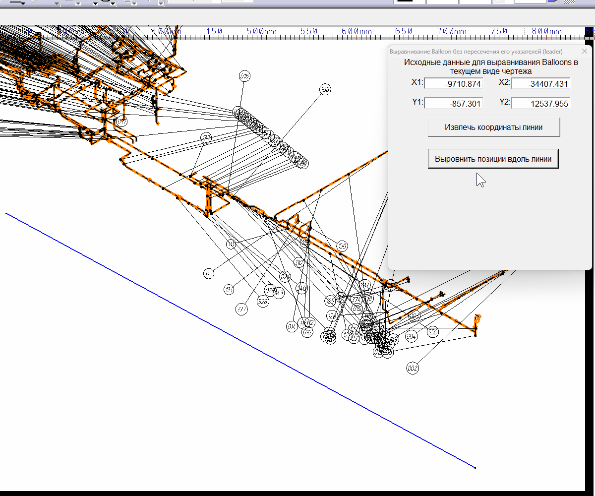
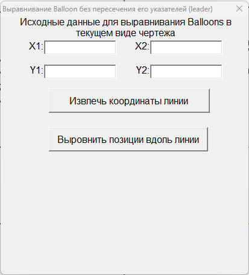

# 📐 CATIA V5 VBA — Align Balloons

**VBA-макрос для CATIA V5 Drafting для автоматического выравнивания выносок (Balloons) вдоль выбранной линии с уменьшением пересечений линий-указателей (Leaders).**

🇷🇺 **Русская версия**
🇬🇧 [English version](#-english-version)

---

## 🎞 Демонстрация работы

[](images/example.gif)

➡️ [Открыть GIF в полном размере](images/example.gif)

---

# 🇷🇺 Русская версия

## 🧩 О проекте

В стандартных инструментах **CATIA V5 Drafting** возможности автоматического позиционирования выносок и позиционных обозначений ограничены.

При работе с большим количеством Balloons могут возникать ситуации, когда:

* 🔀 линии-указатели (**Leaders**) пересекаются;
* 📍 позиции располагаются в неудобном порядке;
* ✏️ после автоматического выравнивания требуется ручная корректировка;
* ⏱ оформление сборочного чертежа занимает дополнительное время.

**VBAProjectAlignBalloons** предлагает альтернативный способ размещения позиционных обозначений.

Макрос распределяет выбранные Balloons вдоль заданной пользователем линии и определяет порядок их размещения с учётом геометрии точек привязки Leaders.

> 💡 Макрос не выполняет прямую геометрическую проверку пересечения каждой пары Leaders.
> Уменьшение количества пересечений достигается за счёт изменения порядка Balloons относительно точек привязки их Leaders.

---

## 🚀 Возможности

Макрос позволяет:

* 📐 выравнивать несколько Balloons вдоль выбранной `Line2D`;
* ↔️ автоматически распределять позиции с одинаковым шагом;
* 🔄 изменять порядок Balloons с учётом геометрии Leaders;
* 🔀 уменьшать вероятность пересечения линий-указателей;
* 🖱 выбирать несколько позиционных обозначений непосредственно в чертеже;
* 🪟 работать через пользовательскую форму **UserForm**;
* 🔓 оставлять форму открытой во время работы с чертежом благодаря режиму `vbModeless`;
* ⚡ сокращать объём ручного редактирования чертежа.

---

## 🖥 Пользовательская форма

[](images/userform.png)

➡️ [Открыть изображение в полном размере](images/userform.png)

Пользовательская форма содержит координаты линии выравнивания:

```text
X1   Y1
X2   Y2
```

и две основные команды:

### 📍 «Извлечь координаты линии»

Получает координаты начальной и конечной точек выбранной в чертеже `Line2D`.

### 📐 «Выровнить позиции вдоль линии»

Позволяет выбрать необходимые Balloons и автоматически разместить их вдоль заданной линии.

---

# ⚙️ Как пользоваться

## 1️⃣ Откройте чертёж

Откройте необходимый документ в **CATIA V5 Drafting**.

---

## 2️⃣ Запустите VBA-проект

Используйте готовый файл:

```text
VBAProjectAlignBalloons.catvba
```

⬇️ [Скачать VBAProjectAlignBalloons.catvba](VBAProjectAlignBalloons.catvba)

Подключение и запуск `.catvba` может немного отличаться в зависимости от версии CATIA V5 и настроек VBA.

---

## 3️⃣ Выберите линию выравнивания

Создайте или выберите в чертеже обычную двумерную линию, вдоль которой необходимо расположить Balloons.

Макрос ожидает объект:

```text
Line2D
```

---

## 4️⃣ Извлеките координаты линии

Выделите линию и нажмите:

**«Извлечь координаты линии»**

Макрос получает координаты:

```text
StartPoint → X1, Y1
EndPoint   → X2, Y2
```

и автоматически записывает их в поля UserForm.

---

## 5️⃣ Запустите выравнивание

Нажмите:

**«Выровнить позиции вдоль линии»**

После этого CATIA перейдёт в режим интерактивного выбора объектов.

---

## 6️⃣ Выберите Balloons

Выберите необходимые позиционные обозначения в текущем виде чертежа и подтвердите выбор.

Макрос обрабатывает объекты типа:

```text
DrawingText
```

у которых имеется как минимум один:

```text
DrawingLeader
```

---

## 7️⃣ Получите результат

После подтверждения выбора макрос:

1. 📏 рассчитывает точки размещения вдоль линии;
2. 📍 получает точки привязки Leaders;
3. 📐 анализирует геометрическое положение каждого Balloon;
4. 🔄 определяет порядок размещения;
5. ↔️ распределяет Balloons вдоль выбранной линии.

✨ В результате позиции становятся более упорядоченными, а количество пересечений Leaders во многих типовых ситуациях уменьшается.

---

# 🧠 Как работает алгоритм

Предположим, пользователь выбрал линию:

```text
A ───────────────────────────── B
```

и несколько Balloons.

---

## 📏 Шаг 1. Определение направления линии

По координатам:

```text
A = (X1, Y1)
B = (X2, Y2)
```

макрос вычисляет вектор направления линии выравнивания.

---

## ↔️ Шаг 2. Расчёт точек размещения

Если выбрано `N` Balloons, вектор линии делится на:

```text
N + 1
```

частей.

Например, для четырёх Balloons:

```text
A     ○     ○     ○     ○     B
```

Благодаря этому первый и последний Balloon не располагаются непосредственно в крайних точках выбранной линии.

---

## 📍 Шаг 3. Получение точки привязки Leader

Для каждого выбранного `DrawingText` макрос получает первый Leader:

```vb
Leaders.Item(1)
```

и определяет его точку привязки.

Условно:

```text
Balloon 1 ─────→ Anchor 1
Balloon 2 ─────→ Anchor 2
Balloon 3 ─────→ Anchor 3
Balloon 4 ─────→ Anchor 4
```

---

## 📐 Шаг 4. Анализ положения

Для каждой будущей позиции Balloon строится вектор:

```text
Target Point → Leader Anchor Point
```

После этого определяется угол между данным вектором и направлением линии выравнивания.

---

## 🔄 Шаг 5. Определение порядка Balloons

Для текущей позиции макрос анализирует оставшиеся Balloons и выбирает объект на основании рассчитанного угла.

После этого Balloon:

* 📍 перемещается в текущую целевую точку;
* ➖ исключается из списка необработанных объектов;
* ➡️ алгоритм переходит к следующей позиции.

Процесс повторяется до тех пор, пока не будут размещены все выбранные Balloons.

---

# 🔀 Почему становится меньше пересечений Leaders?

При обычном последовательном размещении может получиться схема:

```text
1 ─────────────╲
2 ───────╲      ╲
3 ───╲    ╲      ╲
4 ╲    ╲    ╲      ╲
```

Макрос пытается изменить порядок Balloons в соответствии с расположением их Anchor Points:

```text
1 ╲
2  ╲
3   ╲
4    ╲
```

📌 Основной принцип алгоритма:

**согласовать порядок расположения Balloons с пространственным расположением точек привязки их Leaders.**

За счёт этого вероятность перекрёстного расположения линий-указателей уменьшается.

---

# 🪟 Особенности UserForm

Форма запускается в немодальном режиме:

```vb
.Show vbModeless
```

Это позволяет:

* 🪟 оставить окно макроса открытым;
* 🖱 продолжать выбирать объекты непосредственно в CATIA;
* 🔄 выполнять несколько операций без постоянного повторного запуска формы.

---

# 🖱 Интерактивный выбор объектов

Для выбора Balloons используется механизм CATIA Automation:

```vb
Selection.SelectElement3
```

с поддержкой множественного выбора объектов.

Это позволяет пользователю самостоятельно указать, какие позиции необходимо обработать.

---

# 🧮 Работа с 2D-векторами

Для внутренних геометрических расчётов используется пользовательский VBA-тип:

```vb
Private Type ComplexVector
    RealPart As Double
    ImaginaryPart As Double
End Type
```

где:

```text
RealPart      → X
ImaginaryPart → Y
```

Таким образом двумерные координаты используются как векторы для расчёта направления и углов.

---

# 🧱 Структура репозитория

```text
CATIA-V5-VBA-Align-Balloons/
│
├── VBAProjectAlignBalloons.catvba
├── README.md
├── LICENSE
│
├── images/
│   ├── example.gif
│   └── userform.png
│
└── src/
    ├── ModuleAlignBalloons.bas
    ├── UserFormAlignBalloons.frm
    └── UserFormAlignBalloons.frx
```

---

## 📦 Описание файлов

### `VBAProjectAlignBalloons.catvba`

Готовый VBA-проект для запуска в CATIA V5.

➡️ [Скачать VBAProjectAlignBalloons.catvba](VBAProjectAlignBalloons.catvba)

---

### `src/ModuleAlignBalloons.bas`

Основной VBA-модуль.

Содержит точку входа:

```vb
CATMain
```

и отвечает за создание и запуск пользовательской формы.

---

### `src/UserFormAlignBalloons.frm`

Основной код UserForm.

Содержит:

* обработчики кнопок;
* получение координат линии;
* выбор DrawingText;
* работу с Leaders;
* расчёт векторов;
* определение порядка Balloons;
* изменение координат позиционных обозначений.

---

### `src/UserFormAlignBalloons.frx`

Бинарные ресурсы пользовательской формы VBA.

---

### `images/example.gif`

Анимация с примером работы макроса.

🎞 [Открыть example.gif](images/example.gif)

---

### `images/userform.png`

Изображение пользовательской формы.

🖼 [Открыть userform.png](images/userform.png)

---

# ⚠️ Ограничения

В текущей версии необходимо учитывать следующие особенности:

* ⚠️ обрабатываются только объекты `DrawingText`, содержащие Leader;
* ⚠️ используется только первый Leader:

```vb
Leaders.Item(1)
```

* ⚠️ если у одного `DrawingText` несколько Leaders, остальные не участвуют в расчёте;
* ⚠️ макрос не выполняет непосредственную геометрическую проверку пересечений каждой пары Leaders;
* ⚠️ результат зависит от расположения Anchor Points и направления выбранной линии;
* ⚠️ в сложных чертежах после автоматического размещения может потребоваться небольшая ручная корректировка.

---

# 💡 Возможные направления развития

Алгоритм можно дополнительно развивать.

Например:

* 🔍 добавить прямую проверку пересечений Leaders;
* 🚧 учитывать пересечения Leaders с геометрией чертежа;
* 📏 добавить настройку минимального расстояния между Balloons;
* 🔄 автоматически определять оптимальное направление сортировки;
* 🎯 добавить поддержку нескольких Leaders у одного DrawingText;
* ⚙️ расширить настройки UserForm;
* ↔️ добавить дополнительные режимы распределения;
* 📐 добавить дополнительные правила позиционирования Balloons.

---

# 🎥 Видео на YouTube

Подробная демонстрация работы макроса:

▶️ **CATIA V5 VBA макрос — выравнивание выносок (Balloons) в чертежах Drafting**

https://youtu.be/UVtbpVKDkvY

---

# 📥 Скачать

### Готовый VBA-проект

➡️ [**VBAProjectAlignBalloons.catvba**](VBAProjectAlignBalloons.catvba)

### Исходный код

➡️ [`src/`](src/)

### Демонстрация

➡️ [🎞 `example.gif`](images/example.gif)

### Пользовательская форма

➡️ [🖼 `userform.png`](images/userform.png)

---

# 📄 Лицензия

Проект распространяется по лицензии **MIT License**.

Лицензия позволяет использовать, изменять и распространять исходный код при соблюдении условий лицензии и сохранении соответствующего уведомления об авторских правах.

Подробнее:

➡️ [`LICENSE`](LICENSE)

---

# ⚖️ Отказ от ответственности

**CATIA** является товарным знаком **Dassault Systèmes**.

Данный проект является независимой пользовательской разработкой.

Проект:

* не является официальным продуктом Dassault Systèmes;
* не разработан Dassault Systèmes;
* не поддерживается Dassault Systèmes;
* не связан официально с Dassault Systèmes.

---

# 🇬🇧 English Version

## 📐 CATIA V5 VBA — Align Balloons

**VBA macro for CATIA V5 Drafting designed to automatically align drawing balloons along a selected line while reducing leader crossings.**

---

## 🎞 Demo

[](images/example.gif)

➡️ [Open GIF in full size](images/example.gif)

---

## 🧩 About

The standard positioning tools available in **CATIA V5 Drafting** have limited capabilities when working with drawing balloons and their leaders.

When a large number of balloons are positioned, several problems may occur:

* 🔀 leader lines may cross each other;
* 📍 balloons may appear in an inconvenient order;
* ✏️ additional manual adjustment may be required;
* ⏱ drawing preparation may become more time-consuming.

**VBAProjectAlignBalloons** provides an alternative positioning workflow.

The macro distributes selected balloons along a user-defined line and determines their placement order according to the geometry of their leader anchor points.

> 💡 The algorithm does not perform an explicit geometric intersection test between every pair of leaders.
> Leader crossings are reduced by reordering balloons according to their leader anchor geometry.

---

# 🚀 Features

The macro can:

* 📐 align multiple balloons along a selected `Line2D`;
* ↔️ automatically distribute balloons with equal spacing;
* 🔄 reorder balloons according to leader geometry;
* 🔀 help reduce leader crossings;
* 🖱 interactively select multiple balloons directly in the drawing;
* 🪟 provide a dedicated UserForm interface;
* 🔓 keep the UserForm open while interacting with CATIA using `vbModeless`;
* ⚡ reduce manual drawing-editing work.

---

# 🖥 UserForm

[](images/userform.png)

➡️ [Open image in full size](images/userform.png)

The UserForm contains the coordinates of the alignment line:

```text
X1   Y1
X2   Y2
```

and two main commands.

### 📍 Extract line coordinates

Reads the start and end coordinates of the selected `Line2D`.

### 📐 Align balloons along the line

Allows the user to select the required balloons and automatically position them along the specified line.

> The current UserForm interface uses Russian button labels.

---

# ⚙️ Usage

## 1️⃣ Open a drawing

Open the required document in **CATIA V5 Drafting**.

---

## 2️⃣ Run the VBA project

Use:

```text
VBAProjectAlignBalloons.catvba
```

⬇️ [Download VBAProjectAlignBalloons.catvba](VBAProjectAlignBalloons.catvba)

The exact procedure for loading a `.catvba` project may vary depending on the CATIA V5 release and VBA environment configuration.

---

## 3️⃣ Select an alignment line

Create or select a regular 2D line defining where the balloons should be positioned.

The macro expects:

```text
Line2D
```

---

## 4️⃣ Extract the coordinates

Select the line and click:

**«Извлечь координаты линии»**

The macro reads:

```text
StartPoint → X1, Y1
EndPoint   → X2, Y2
```

The values are automatically displayed in the UserForm.

---

## 5️⃣ Start alignment

Click:

**«Выровнить позиции вдоль линии»**

CATIA switches to interactive selection mode.

---

## 6️⃣ Select the balloons

Select the required balloons in the current drawing view and validate the selection.

The macro processes:

```text
DrawingText
```

objects containing at least one:

```text
DrawingLeader
```

---

## 7️⃣ Result

After the selection is validated, the macro:

1. 📏 calculates target positions;
2. 📍 retrieves leader anchor points;
3. 📐 analyzes balloon geometry;
4. 🔄 determines the balloon order;
5. ↔️ distributes the selected balloons along the line.

✨ The result is a more organized balloon layout with fewer leader crossings in many typical drawing situations.

---

# 🧠 How the algorithm works

Assume the user selects the following line:

```text
A ───────────────────────────── B
```

and several balloons.

---

## 📏 Step 1 — Determine the alignment direction

The coordinates:

```text
A = (X1, Y1)
B = (X2, Y2)
```

are used to calculate the alignment vector.

---

## ↔️ Step 2 — Calculate target positions

For `N` selected balloons, the line vector is divided into:

```text
N + 1
```

segments.

For example, four balloons are positioned approximately as follows:

```text
A     ○     ○     ○     ○     B
```

This prevents the first and last balloons from being placed directly at the endpoints of the selected line.

---

## 📍 Step 3 — Get the leader anchor point

For every selected `DrawingText`, the macro uses the first leader:

```vb
Leaders.Item(1)
```

and retrieves its anchor point.

Conceptually:

```text
Balloon 1 ─────→ Anchor 1
Balloon 2 ─────→ Anchor 2
Balloon 3 ─────→ Anchor 3
Balloon 4 ─────→ Anchor 4
```

---

## 📐 Step 4 — Analyze geometry

For every target position, a vector is calculated:

```text
Target Point → Leader Anchor Point
```

The macro then calculates the angle between this vector and the selected alignment-line direction.

---

## 🔄 Step 5 — Determine balloon order

For the current target position, the macro evaluates the remaining balloons according to the calculated angle.

The selected balloon is then:

* 📍 moved to the current target position;
* ➖ removed from the remaining collection;
* ➡️ followed by processing of the next target position.

The procedure continues until all selected balloons have been positioned.

---

# 🔀 Why does this reduce leader crossings?

A simple sequential arrangement may produce a layout similar to:

```text
1 ─────────────╲
2 ───────╲      ╲
3 ───╲    ╲      ╲
4 ╲    ╲    ╲      ╲
```

The macro attempts to reorder the balloons according to the locations of their leader anchor points:

```text
1 ╲
2  ╲
3   ╲
4    ╲
```

📌 The main idea is to:

**match the balloon order with the spatial order of their leader anchor points.**

This helps reduce the probability of crossed leaders.

---

# 🪟 Modeless UserForm

The UserForm is launched using:

```vb
.Show vbModeless
```

This allows the user to:

* 🪟 keep the macro window open;
* 🖱 continue selecting objects in CATIA;
* 🔄 perform repeated operations without reopening the UserForm.

---

# 🖱 Interactive selection

The macro uses the CATIA Automation selection mechanism:

```vb
Selection.SelectElement3
```

to support interactive multi-selection.

---

# 🧮 2D vector calculations

A custom VBA type is used internally for 2D vector calculations:

```vb
Private Type ComplexVector
    RealPart As Double
    ImaginaryPart As Double
End Type
```

where:

```text
RealPart      → X
ImaginaryPart → Y
```

---

# 🧱 Repository structure

```text
CATIA-V5-VBA-Align-Balloons/
│
├── VBAProjectAlignBalloons.catvba
├── README.md
├── LICENSE
│
├── images/
│   ├── example.gif
│   └── userform.png
│
└── src/
    ├── ModuleAlignBalloons.bas
    ├── UserFormAlignBalloons.frm
    └── UserFormAlignBalloons.frx
```

---

# 📦 Files

### `VBAProjectAlignBalloons.catvba`

Ready-to-use CATIA VBA project.

➡️ [Download VBAProjectAlignBalloons.catvba](VBAProjectAlignBalloons.catvba)

### `src/ModuleAlignBalloons.bas`

Macro entry point and UserForm launcher.

### `src/UserFormAlignBalloons.frm`

Contains the UserForm source code and the main balloon-alignment algorithm.

### `src/UserFormAlignBalloons.frx`

Binary resources used by the VBA UserForm.

### `images/example.gif`

Animated macro demonstration.

🎞 [Open example.gif](images/example.gif)

### `images/userform.png`

UserForm screenshot.

🖼 [Open userform.png](images/userform.png)

---

# ⚠️ Limitations

The current implementation has several known limitations:

* ⚠️ only `DrawingText` objects containing leaders are processed;
* ⚠️ only the first leader is currently used:

```vb
Leaders.Item(1)
```

* ⚠️ additional leaders attached to the same `DrawingText` are not included in the calculation;
* ⚠️ the macro does not explicitly calculate geometric intersections between every pair of leaders;
* ⚠️ the result depends on anchor-point geometry and the selected alignment direction;
* ⚠️ complex drawings may still require minor manual adjustment.

---

# 💡 Possible future improvements

Possible enhancements include:

* 🔍 explicit leader-intersection detection;
* 🚧 collision detection between leaders and drawing geometry;
* 📏 configurable minimum spacing between balloons;
* 🔄 automatic selection of the optimal sorting direction;
* 🎯 support for multiple leaders per `DrawingText`;
* ⚙️ additional UserForm settings;
* ↔️ additional distribution modes;
* 📐 additional balloon-positioning rules.

---

# 🎥 Video demonstration

A detailed demonstration of the macro is available on YouTube:

▶️ **CATIA V5 VBA Macro — Aligning Balloons in Drafting Drawings**

https://youtu.be/UVtbpVKDkvY

---

# 📥 Download

### Ready-to-use VBA project

➡️ [**VBAProjectAlignBalloons.catvba**](VBAProjectAlignBalloons.catvba)

### Source code

➡️ [`src/`](src/)

### Demo GIF

➡️ [🎞 `example.gif`](images/example.gif)

### UserForm image

➡️ [🖼 `userform.png`](images/userform.png)

---

# 📄 License

This project is distributed under the **MIT License**.

You may use, modify and redistribute the source code subject to the terms of the license.

See:

➡️ [`LICENSE`](LICENSE)

---

# ⚖️ Disclaimer

**CATIA** is a trademark of **Dassault Systèmes**.

This project is an independent community utility.

It:

* is not an official Dassault Systèmes product;
* was not developed by Dassault Systèmes;
* is not supported by Dassault Systèmes;
* is not officially affiliated with Dassault Systèmes.
